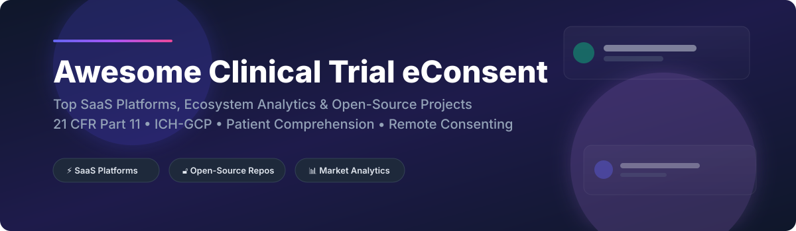

# 🩺 Awesome Clinical Trial eConsent Platforms Ecosystem 🚀

  

  
  
  
  
  
  

**Comprehensive Curated Directory of Enterprise SaaS Solutions & Open-Source Repositories for Electronic Informed Consent (eConsent) in Clinical Research**

*Optimized for Electronic Informed Consent (eICF), Patient Comprehension Verification, Remote Consenting, Telehealth Recruitment, Biobanking & Regulatory Audit Compliance (21 CFR Part 11, HIPAA, GDPR).*

📅 **Last updated: September 2026**

---

## 📌 Ecosystem Overview & Market Dynamics 📊

> 💡 **Global eConsent & eClinical Market Size**: The global eConsent market size is estimated at **~$450 Million - $650 Million in 2026**, growing at a CAGR of ~11.5% towards $1+ Billion by 2030, accelerated by decentralized clinical trials (DCTs) and hybrid study designs.
>
> 🧩 **Market Concentration & Structure**: The eConsent sector is **moderately concentrated** among major eClinical platform suites (Veeva, Medidata, Clario, Advarra). However, it remains **fragmented in specialized decentralized trial niches** (THREAD, Medable, Science 37) and academic research solutions. While core EDC/eCOA suites hold strong distribution advantages, standalone eConsent solutions continue to innovate in patient-facing multimedia and multi-language comprehension verification.

---

## 📋 Table of Contents 📑

- [🏢 SaaS/Hosted Platforms](#-saashosted-platforms)
- [🔓 Open-Source GitHub Projects](#-open-source-github-projects)
- [🤝 How to Contribute](#-how-to-contribute)
- [☕ Support & Sponsorship](#-support--sponsorship)
- [📈 Star History](#-star-history)
- [⚠️ Disclaimer](#-disclaimer)

---

## 🏢 SaaS/Hosted Platforms

*Sorted by company scale, annual revenue, and market valuation (descending order)*

| SaaS Platform 🛠️ | Description 📝 | Company Size / Valuation / Revenue 💰 | Pricing (Starting Tier) 💵 | Free Tier Limits / Free Trial 🎁 |
| :--- | :--- | :--- | :--- | :--- |
| **[Medidata eConsent](https://www.medidata.com/)** | Enterprise patient-friendly eConsent in Medidata's Patient Cloud suite. Features multimedia education, 100% BYOD support, remote consenting, and native Rave EDC / RTSM integration. | **Dassault Systèmes Subsidiary** ($6.1B+ Annual Revenue / ~$45B+ Parent Market Cap) | Starts at ~$20,000–$100,000+ per study implementation (custom enterprise contract model based on study scale and modules). | **No free tier or trial.** Demo and enterprise consultation required. |
| **[Veeva eConsent](https://www.veeva.com/)** | Site-focused eConsent in Veeva SiteVault. Enables sites to manage eICF signatures, send forms via MyVeeva app, and manage paper-signed ICFs as certified copies. | **Public ($VEEV)** (~$35 Billion Market Cap / $2.6B+ Annual Revenue) | Enterprise licenses are custom-priced per sponsor/CRO contract based on deployment scale and integration needs. | **Free SiteVault tier** available for clinical research sites running **up to 20 concurrent active studies** (includes unlimited users and documents). |
| **[Clario eConsent](https://clario.com/)** | Enterprise eConsent within Clario's clinical trial technology suite, integrated with eCOA and cardiac safety endpoints. | **Private Enterprise** (~$1.0B+ Estimated Revenue / PE Backed by Nordic Capital & Astorg) | Custom enterprise quotes based on study duration, participant count, and safety endpoint integrations. | **No free tier or trial.** Provides a free online eCOA cost-estimation tool on their site. |
| **[Advarra eConsent](https://www.advarra.com/)** | Site-specific eConsent module in Advarra eReg system with interactive multimedia, comprehension quizzes, remote LAR consent, and CIRBI IRB integration. | **Private Enterprise** (~$500M+ Estimated Revenue / PE Backed by Genstar & Linden) | Custom enterprise quotes based on study complexity, site count, and CTMS/eReg integration parameters. | **No free tier or trial.** Demo and enterprise consultation required. |
| **[Medable eConsent](https://www.medable.com/)** | Patient-friendly eConsent module in Medable's DCT platform with multimedia education, BYOD support, and multi-language workflows. | **Venture Backed ($2.1B Valuation)** (~$100M+ Estimated Revenue / Raised $500M+) | Custom enterprise pricing tailored by number of studies, sites, participant volume, and language requirements. | **No free tier or trial.** Diagnostic quiz and customized proposal required. |
| **[Science 37 eConsent](https://www.science37.com/)** | Virtual eConsent module within Science 37's Metasite unified platform supporting virtual trial orchestration, telemedicine, and wearable data flows. | **eResearch Technology / Private Acquisition** (~$70M+ Estimated Revenue) | Custom contract pricing (often utilizing results-based or project-based enrollment models). | **No free tier or trial.** Sales demo and custom study scoping required. |
| **[THREAD eConsent](https://www.threadresearch.com/)** | Mobile eConsent (iOS/Android, BYOD or provisioned) supporting single and dual-signature workflows for telehealth, remote, or in-clinic consent. | **Private Enterprise** (~$50M+ Estimated Revenue / PE Backed by Water Street & JLL) | Custom project-based pricing tailored to study protocol complexity, site count, and participant volume. | **No free tier or trial.** Custom 30-minute demo and protocol assessment required. |
| **[Castor eConsent](https://www.castoredc.com/)** | eConsent module in Castor EDC platform for capturing electronic consent integrated with Castor's broader eClinical ecosystem. | **Growth Stage** (~$25M+ Estimated Revenue / Raised $60M+) | Custom per-study subscription (entry-level small study subscriptions reported starting at low hundreds of dollars/month). | **No free tier.** Offers a **free platform trial/demo** to test study building and EDC features. |
| **[Clinion eConsent](https://clinion.com/)** | AI-powered clinical trial platform eConsent module providing electronic consent capture, comprehension quizzes, and audit trails. | **Mid-Market Enterprise** (~$15M+ Estimated Revenue) | Custom per-study or portfolio licensing quotes based on study scale and module bundle. | **No free tier or trial.** Price-on-request and demo required. |
| **[TrialKit eConsent](https://www.trialkit.com/)** | Flexible eConsent capability within TrialKit's cloud-based clinical research platform for web and mobile devices. | **Private Bootstrapped / Growth** (~$10M+ Estimated Revenue) | Tiered subscription starting with **Pilot Tier** (1 live concurrent study); custom quotes for unlimited live study tiers. | **Free Builder Version** allows users to register, build, test, and manage clinical study forms without a credit card. |

---

## 🔓 Open-Source GitHub Projects

*Sorted by GitHub Star Count (descending order)* 🌟

-  **[carp-dk/research.package](https://github.com/carp-dk/research.package)**  
  Flutter research package designed for building digital health and clinical research apps. Includes built-in support for **obtaining informed consent**, digital signature capture, step-by-step consent flows, and visual summary pages. **Open source, Flutter/Dart**.

-  **[Pryv.io (open-pryv.io)](https://github.com/pryv/open-pryv.io)**  
  Personal data lifecycle and consent management infrastructure recognized as a **Digital Public Good** by the UN-endorsed DPGA. Features a federated consent protocol for decentralized remote clinical trials and real-world data (RWD) collection. **Open source, Node.js**.

-  **[OpenSpecimen eConsents Module](https://github.com/krishagni/openspecimen)**  
  eConsents module within OpenSpecimen, a biobanking and clinical research platform. Enables collection of **IRB-formatted consents**, version control, eSignatures, multi-language support, and tablet patient mode data entry. **Open source, Java**.

-  **[gICS (generic Informed Consent Service)](https://github.com/mosaic-hgw/gICS)**  
  The most established open-source consent management service in research, developed at University Medicine Greifswald. Facilitates modular digital informed consent management, differentiated consent states, and automated system-to-system consent verification (336,000+ consents documented). **Open source, Java**.

-  **[REDCap Multi-Signature Consent](https://github.com/susom/multi-signature-consent)**  
  REDCap External Module that merges participant and coordinator consent signatures across multiple REDCap forms into a single consolidated eConsent PDF document for archival. **Open source, PHP**.

-  **[Uninformed Consent Analysis Tool](https://github.com/RUB-SysSec/uninformed-consent)**  
  Research framework for analyzing digital consent dialogs, compliance verification, and data tracking consent flows across automated applications. **Open source, Python**.

- 💡 **[REDCap Enhanced eConsent Framework](https://projectredcap.org/)**  
  Built-in **eConsent 2.0** framework within REDCap for non-profit research institutions. Includes PDF snapshots, inline certification pages, identity footers (Name/DOB), and automated PDF archival. **Free for non-profit consortium members**.

- 💡 **[Improved e-Consent Framework (Cincinnati Children's)](https://confluence.research.cchmc.org/)**  
  Detailed implementation guidelines, IRB migration protocols, and configuration scripts for REDCap eConsent 2.0 deployments. **Documentation resource**.

---

## 🤝 How to Contribute 🛠️

1. 🍴 **Fork the repository**.
2. 📝 Add or update entries in `README.md` keeping formatting consistent.
3. 🔎 Ensure descriptions are factual and link directly to official project repositories or official platform homepages.
4. 📬 Submit a Pull Request (PR) with a clear explanation of additions.

---

## ☕ Support & Sponsorship 💖

If you find this eConsent ecosystem directory helpful in your clinical research, site administration, or software development, please consider supporting the project:

- ⭐ **Star this repository** to help others discover it!
- 🔀 **Fork and share** with clinical operations, regulatory affairs, and biobanking colleagues.
- ☕ **Sponsor / Buy me a coffee**: Support ongoing open-source research and maintenance via the [GitHub Sponsor Dashboard](https://github.com/sponsors/ishandutta2007).

---

## 📈 Star History

---

## ⚠️ Disclaimer 📄

- This repository is a **community-curated informational directory** and does not constitute endorsement or regulatory advice.
- Clinical trial eConsent software handling protected health information (PHI) must be validated for compliance with **21 CFR Part 11, HIPAA, GDPR, ICH-GCP**, and local ethics board (IRB/IEC) requirements.

---

  <b>Made with ❤️ for clinical research coordinators, site administrators, regulatory teams, and eClinical developers.</b>

